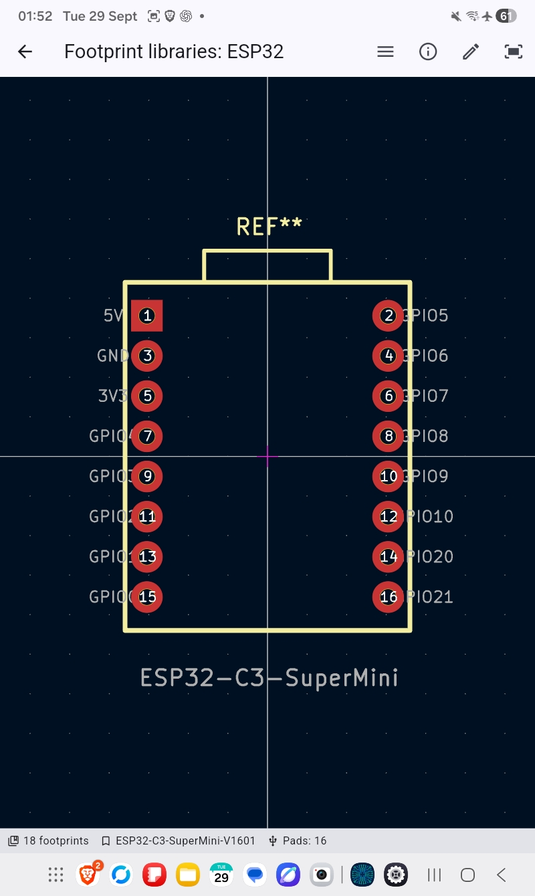

# CircuitEDA Maker Library

A practical KiCad-compatible component library for
[Circuit EDA](https://play.google.com/store/apps/details?id=cloud.iothub.pcbeda)
on Android, with a focus on maker electronics.

The goal is simple:

**Pick a component, see a useful pinout, and place the correct footprint.**

The library is being built around commonly used ESP32/ESP8266 boards,
sensors, motor control hardware and maker modules.

> **Status:** early release / work in progress  
> Tested with Circuit EDA `0.0.1-m1` on Android.

---

## Current contents

### ESP32

Includes footprints for commonly used Espressif modules and boards such as:

- ESP32-C3 DevKitM-1
- ESP32-C3 SuperMini V1601
- ESP32-C3-WROOM-02 / 02U
- ESP32-C6-MINI-1
- ESP32-S2-MINI-1 / 1U
- ESP32-S2-WROVER
- ESP32-S3-WROOM-1 / 1U / 2
- ESP32-WROOM-32 / 32D / 32E / 32U / 32UE
- Seeed ESP32-C3

### ESP8266 / Wemos

Includes:

- ESP-01
- ESP-07
- ESP-12E
- ESP-WROOM-02
- Wemos D1 Mini Light
- Wemos C3 Mini

### ESP32-C3 SuperMini

A dedicated schematic symbol and footprint for the commonly available
ESP32-C3 SuperMini V1601 board is included.

The schematic symbol exposes useful pin names rather than forcing the user
to work from anonymous header numbers.

The footprint is located in:

    libraries/footprints/ESP32.pretty/

The symbol is located in:

    libraries/symbols/ESP32_Boards.kicad_sym

---

## Android / Circuit EDA installation

### Important: use "Open project from ZIP"

During testing we found that Circuit EDA `0.0.1-m1` on Android may be unable
to read project library tables when a project is opened directly from Android
shared storage.

For example, a project under:

    /storage/emulated/0/Documents/...

may fail while loading `fp-lib-table` or `sym-lib-table` with an error similar
to:

    PathAccessException
    Permission denied (errno = 13)

### Working method

From the Circuit EDA welcome screen choose:

**Open project from ZIP**

Circuit EDA extracts the project into its private application storage, for
example:

    /data/user/0/cloud.iothub.pcbeda/code_cache/pcb_eda_zip_import/...

The project-local KiCad library tables can then be loaded normally.

This method has been successfully tested with thousands of KiCad symbols
and footprints.

---

## Library structure

    libraries/
    ├── footprints/
    │   ├── ESP32.pretty/
    │   ├── ESP8266_Wemos.pretty/
    │   ├── Sensors_Modules.pretty/
    │   ├── Motor_Drivers.pretty/
    │   ├── Motors_Steppers.pretty/
    │   └── ...
    │
    └── symbols/
        ├── ESP32_Boards.kicad_sym
        ├── MCU_Espressif.kicad_sym
        ├── Sensor_Temperature.kicad_sym
        ├── Driver_Motor.kicad_sym
        └── ...

Project-local library tables use `$(KIPRJMOD)` paths so that the complete
project remains portable.

---

## Planned additions

Future releases are intended to add practical board/module symbols and
footprints for:

- BME280 / BMP280
- DHT11 / DHT22
- DS18B20
- soil moisture sensors
- HC-SR04
- VL53L0X and other ToF sensors
- OLED display modules
- relay modules
- MOSFET modules
- logic-level converters
- buck converters
- A4988
- DRV8825
- TMC2208 / TMC2209
- NEMA stepper motor connections
- other commonly used maker modules

Where possible, symbols will contain useful pin names and functions.

---

## Design philosophy

This repository is deliberately **not** intended to become an unverified
dump of random Internet footprints.

Preferred source order is:

1. Manufacturer datasheet
2. Manufacturer-provided KiCad library
3. Official KiCad library
4. Verified community contribution
5. Custom footprint checked against mechanical documentation

PCB footprints should be treated as engineering data. Always verify critical
dimensions against the datasheet for the exact hardware revision being used.

---

## KiCad

The library uses modern KiCad `.kicad_sym`, `.pretty` and `.kicad_mod`
formats and project-local `fp-lib-table` / `sym-lib-table` files.

It is primarily assembled for Circuit EDA on Android, but the underlying
libraries are KiCad compatible.

---

## License and attribution

This repository contains library material derived from multiple sources.

See [ATTRIBUTION.md](ATTRIBUTION.md) for details.

KiCad library material is distributed under the Creative Commons
Attribution-ShareAlike 4.0 license with the KiCad Libraries Exception.

Espressif KiCad library material is distributed under its applicable
upstream license.

Original CircuitEDA Maker Library additions are released under
CC BY-SA 4.0 unless otherwise noted.

---

## Contributing

Corrections and additional verified maker components are welcome.

For footprint contributions, please include the manufacturer datasheet or
other dimensional source used for verification.

---

## Disclaimer

Always verify footprints, pin numbering, voltage levels and special-purpose
GPIO behaviour against the datasheet for the exact component or board
revision before manufacturing a PCB.
